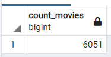

# Movies-ETL

## Objective

The objective of this project is to create a function that takes in three files related to films and prerforms the ETL process and adds the data to a PostgresSQL database. The process involved evaluating the data provided and merging two large lists of movies and adding to that a rating score to the movies. As the ratings file was too large it has not been included on GitHub. However, if you wish to see the lists they are located below. 

[movies_metadata.csv](./Resources/movies_metadata.csv)

[wikipedia-movies.json](./Resources/wikipedia-movies.json)

## PostgresSQL

Once the movies were moved into a SQL database they are ready to be queried and analyzed. The lists of information was quite large, please see the images below for more information.

The Movies List

The Ratings List

## Python via Jupyter Notebook

This is the Python code used to merge the data and to create the databases.

Deliverable 1

[ETL_function_test.ipynb](./ETL_function_test.ipynb)

Deliverable 2

[ETL_clean_wiki_movies.ipynb](./ETL_clean_wiki_movies.ipynb)

Deliverable 3

[ETL_clean_kaggle_data.ipynb](./ETL_clean_kaggle_data.ipynb)